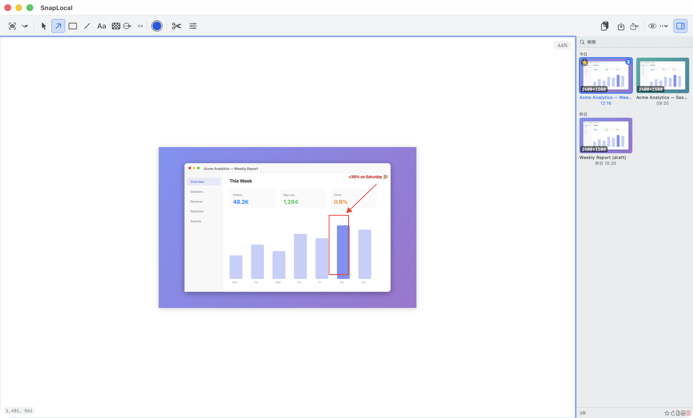

# SnapLocal

A macOS screenshot tool that runs entirely on-device — no cloud, no account, no API keys.

Designed for organizations that need a searchable screenshot archive without sending data to external services.

  



## Features

- **Full-screen and region capture** — `⌘⇧2` for full screen, `⌘⇧4` for area selection
- **On-device OCR** — Apple Vision framework indexes the text in every screenshot; no network request is made
- **Full-text search** — search your screenshot history by the text visible in the image
- **Annotation tools** — arrows, rectangles, ellipses, lines, text, mosaic, blur; undo/redo supported
- **Persistent history** — screenshots survive app restarts; stored under `~/Pictures/SnapLocal/` by default
- **Clipboard integration** — captured image is copied to the clipboard immediately
- **No external dependencies** — built entirely with Apple frameworks (ScreenCaptureKit, Vision, SwiftUI)

## Requirements

- macOS 14 (Sonoma) or later
- Screen Recording permission (granted on first launch)
- Xcode command-line tools (`xcode-select --install`)

## Build

```bash
git clone https://github.com/your-org/SnapLocal.git
cd SnapLocal
bash build-app.sh
open .build/debug/SnapLocal.app
```

On first launch, macOS will ask for Screen Recording permission. Grant it, then restart the app.

## Storage layout

```
~/Pictures/SnapLocal/
  index.json          # metadata index (id, timestamp, OCR text, filename)
  {uuid}.png          # full-resolution capture
  thumbnails/
    {uuid}.jpg        # JPEG thumbnail for the history panel
```

The save directory can be pointed at a Google Drive folder or any local path — change it in Settings. This is the only "sync" option: SnapLocal itself never uploads anything.

## Project structure

```
Sources/
  SnapLocalApp/       # macOS GUI app (SwiftUI + ScreenCaptureKit + Vision)
    App.swift                 # main view, state management
    CaptureEngine.swift       # full-screen and region capture
    RegionCapture.swift       # area-selection overlay
    PersistentVault.swift     # disk storage + OCR indexing
    AnnotationCanvas.swift    # annotation canvas and tools
    Settings.swift            # user preferences
Tests/
  SnapLocalTests/     # unit tests
```

## Roadmap

- [ ] Right-click delete in history panel
- [ ] Multi-display region capture
- [ ] Window capture mode
- [ ] System notifications on capture
- [ ] Hotkey configuration UI
- [ ] Launch at Login toggle

## Contributing

See [CONTRIBUTING.md](CONTRIBUTING.md).

## License

MIT — see [LICENSE](LICENSE).
